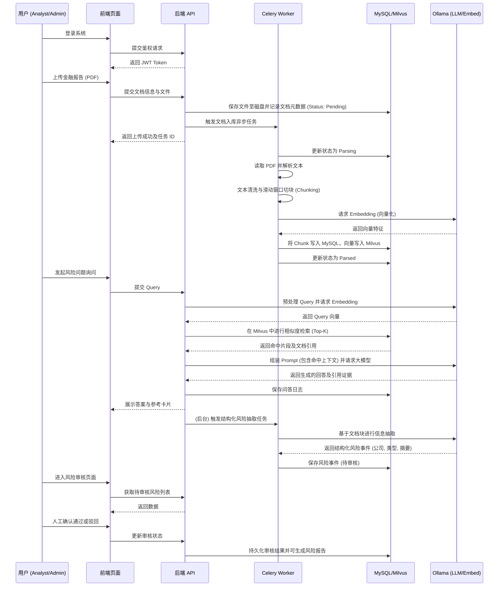
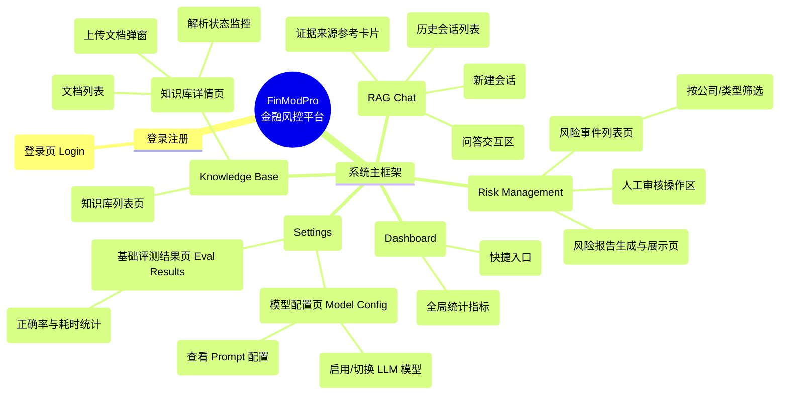

# 系统设计与图示 (Thesis Diagrams)

本文档包含了用于毕业论文和答辩演示的系统核心架构图、业务流程图和页面导航图。
所有图表均使用 Mermaid 语法编写，可以直接在支持 Mermaid 的 Markdown 编辑器（如 Typora, VS Code, GitHub）中预览，或通过 [Mermaid Live Editor](https://mermaid.live/) 导出为 PNG/SVG 格式以插入论文。

## 1. 系统架构图 (System Architecture)

该图展示了 FinModPro 平台的前端、后端、数据库、缓存、向量引擎以及大语言模型服务的整体架构和数据流向。

```mermaid
graph TD
    %% 前端层
    subgraph Frontend [前端表示层 (Vue 3 / Vite)]
        UI[Web UI 界面]
        Router[Vue Router]
        Store[状态管理]
        API_Client[Axios 请求客户端]
        UI --> Router
        UI --> Store
        UI --> API_Client
    end

    %% API 交互
    API_Client -- HTTP/REST API --> Gateway[Nginx / API 网关]
    
    %% 后端服务层
    subgraph Backend [后端服务层 (Django / DRF)]
        Gateway --> Auth[Authentication 认证鉴权]
        Gateway --> CoreAPI[业务 API (知识库, 问答, 风险)]
        
        Auth --> CoreAPI
        
        CoreAPI --> Tasks[异步任务触发]
    end

    %% 异步任务层
    subgraph AsyncTasks [异步任务处理 (Celery)]
        Tasks -- 发布任务 --> RedisBroker[(Redis Broker)]
        RedisBroker -- 消费任务 --> Worker[Celery Worker (文档解析/向量化)]
    end

    %% 数据持久层
    subgraph DataStorage [数据与存储层]
        CoreAPI -- 读写业务数据 --> MySQL[(MySQL 关系型数据库)]
        Worker -- 读写文档元数据 --> MySQL
        Worker -- 保存/读取文件 --> MediaStorage[本地文件系统 / Media 目录]
        CoreAPI -- 读写/下载文件 --> MediaStorage
        Worker -- 写入向量数据 --> Milvus[(Milvus 向量数据库)]
        CoreAPI -- 向量检索 --> Milvus
    end

    %% AI 模型层
    subgraph AI_Layer [AI 模型服务层 (Ollama)]
        Worker -- 调用 Embedding 模型 --> EmbedModel[Embedding 服务]
        CoreAPI -- 调用 Chat 模型 --> ChatModel[LLM 对话服务]
    end
```

## 2. 核心业务流程图 (Core Business Flow)

该图展示了从文档上传入库，到智能问答与风险抽取的完整业务生命周期。



## 3. 页面结构与导航图 (Page Navigation / Structure)

该图展示了前端应用的主要页面层级关系与导航路径。



## 导出说明

由于大部分学术论文需要图片格式（如 `.png`, `.jpg` 或 `.eps`, `.svg`），您可以通过以下方式将这些图转换为所需的格式：

1. **推荐：** 复制各个代码块（```mermaid ... ``` 中的内容），粘贴至 [Mermaid Live Editor](https://mermaid.live/)，在界面右上角点击 "Actions" -> "Download PNG" 或 "Download SVG"。
2. **VS Code：** 安装 `Markdown Preview Mermaid Support` 插件，在预览视图中右键保存为图片。
3. **Typora：** Typora 原生支持 Mermaid，可以在预览状态下右键图片选择保存或导出。

然后将导出的图片放入 `docs/defense-assets/screenshots/` 或其他存放答辩素材的目录中即可在论文中引用。
